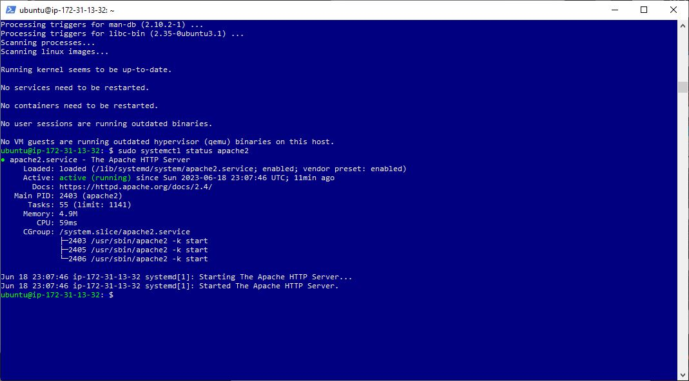

# H1 Project 1 codes and commands

`sudo apt update` 
`sudo apt install apache2` 
`sudo systemctl status apache2` 

[Open ssh](https://learn.microsoft.com/en-us/windows-server/administration/openssh/openssh_install_firstuse?tabs=gui#install-openssh-for-windows)

[Install Apache](https://www.digitalocean.com/community/tutorials how-to-install-the-apache-web-server-on-ubuntu-20-04)